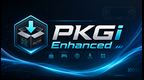

# PKGi Enhanced

<p align="center">
  
</p>

PKGi Enhanced is a PSP homebrew multimedia downloader based on PKGi, expanded for games, NPS content, apps, emulators, PSX ZIP packs, movies, music, TV shows, wallpapers, updates, DLCs, themes, and direct file downloads.


## Download

Download the latest PSP release ZIP:

[Download PKGi Enhanced v1.1.42](http://archive.org/download/pkgi-enhanced/pkgi-enhanced-v1.1.42.zip)

The PSP app includes a built-in updater for future releases.

## About PKGi Enhanced

PKGi Enhanced keeps compatibility with existing PKGi catalog-style text files while adding more content categories and safer download handling for real PSP hardware.

Downloads are staged through a temporary folder first, then finalized into the selected destination after completion. ZIP-based apps, emulators, and PSX packs can be extracted into a folder chosen by the user.

## Features

### Catalog Categories

* Games through `pkgi_games.txt`
* NPS Games through `pkgi_nps_games.txt`
* NPS PSX through `pkgi_nps_psx.txt`
* PSX ZIP packs through `pkgi_psx.txt`
* DLCs, themes, and updates
* Emulators and apps
* Movies, TV shows, music videos, and music
* Movie ISOs
* Wallpapers

### Download And Install Flow

* Downloads use temporary `.part` files before finalizing.
* Interrupted downloads can resume.
* SHA-256 validation is supported when checksums are provided.
* Completed files are moved into the selected destination folder.
* Existing files are protected from silent overwrite.
* Folder selection can remember the last folder per category.

### ZIP Support

* Apps and emulators can extract into clean app folders.
* PSX ZIP packs can extract into a user-selected game folder.
* Music album ZIPs can extract as album folders.
* Movies and TV show ZIPs can extract to media folders.
* Single-root ZIPs are handled without creating doubled folders.

### PSP Hardware Support

* Designed for real PSP hardware.
* Uses HTTP update links for PSP compatibility.
* Works with Memory Stick paths like `ms0:/PSP/GAME/`.
* Supports category folders from plugins such as Game Categories Lite when the user selects the final folder.

## Getting Started

1. Download the latest ZIP from the Download section.
2. Extract the `PKGi Enhanced` folder.
3. Copy `PKGi Enhanced` to:

```text
ms0:/PSP/GAME/
```

4. Add or update the catalog `.txt` files inside the `PKGi Enhanced` folder.
5. Launch PKGi Enhanced from the PSP Game menu.

## Catalog Files

PKGi Enhanced reads category catalogs from text files placed beside the EBOOT:

```text
pkgi_games.txt
pkgi_psx.txt
pkgi_nps_games.txt
pkgi_nps_psx.txt
pkgi_dlcs.txt
pkgi_themes.txt
pkgi_updates.txt
pkgi_emulators.txt
pkgi_apps.txt
pkgi_movies.txt
pkgi_music.txt
pkgi_wallpapers.txt
pkgi_movie_iso.txt
pkgi_music_videos.txt
pkgi_tv_shows.txt
```

## Important Note

Use PKGi Enhanced only with files, homebrew, media, and backups that you own or have permission to download and share. You are responsible for following the rules that apply to the content and services you use.

PKGi Enhanced is an independent homebrew project. It is not affiliated with, sponsored by, or endorsed by Sony.

## Project Updates And Support

* Follow the project creator on Instagram: [@god1ynigga](https://instagram.com/god1ynigga)
* Support development through Venmo: [venmo.com/u/godlynigga](https://venmo.com/u/godlynigga)

## About This Repository

This is the public release page for PKGi Enhanced. Downloadable release ZIPs are published through Archive.org and may also be mirrored through GitHub Releases.

The application source code and private build workflow are maintained separately.
